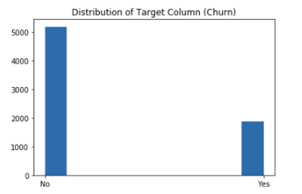
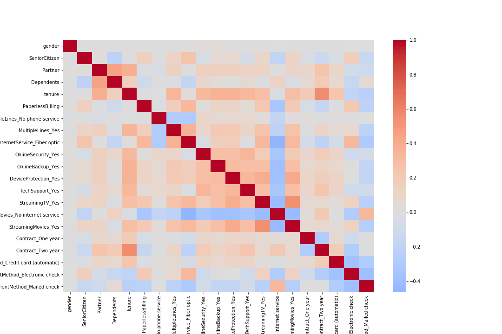
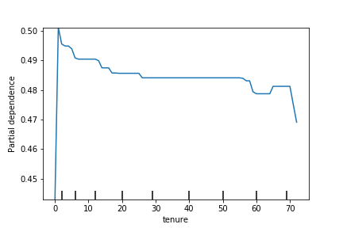
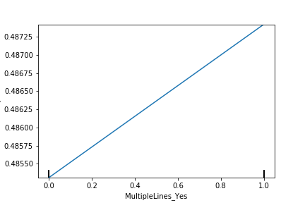
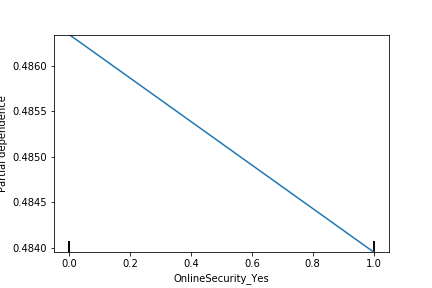

# churn-Model Project

## The problem

The problem is that in our telco business we occasionally have customers leave us. We assume that the rate of customers leaving us is
too high and we want a way (a)  predict which customers are going to leave, and (b) identify the key factors which are causing customers leaving us.

## The value of problem being solved

If we can predict which customers are going to leave us, we could offer them some special benefits and ensure they get good customer service. This might encourage them to stay.

Also, if we are able to understand the underlying factors that cause customers to leave, then we can fix those problems and create more value and better experience for  customers.

## Outline of the Solution

* We cleaned the dataset by imputing minimum value that was 20 for missing TotalCharges values (though there were just 8 that were missing).
* We featurized the dataset by:
    1. Dropping the customer ID Column.
    2. Transformed categorical features into binary 0 and 1 features using one-hot-encoding.
    3. Dropped highly correlated features using a cut off of VIF = 10.
* We experimented with different Machine Learning models, and settled using AdaBoost model.
* After trying various Hyperparameter values, we ended up using default scikit values except for learning_rate which we set to 0.6 and n_estimators = 50.

## EDA
Explored the data and plotted the distribution of the target varible and numerical attributes

The following heatmap shows the correlation between the features after OneHot Encoding

## Main results
* The following are the Partial Dependence plots for Tenure, having MultipleLines, and Online security

* Customer Tenure seemed to impact churn rate quite a bit -- this was potentially the most important feature. The longer the customer has been with us, the less likely they are to churn.
* Additionally, these customer attributes were correlated with churn
    * Having Multiple lines
    * Paying with an electronic check
    * having a phone service
    * Having streaming TV
    * Having paper less billing
    * having fiber optic internet service
* And these are the customer attributes that were negatively correlated with churn (correlated with customer retention)
    * Having Online Security
    * Having no internet Service(streming movies)
    * Having a one year or two year contract
    
## Exaluation of model on Test data

We evaluated the model on test data and got a ROC AUC score of 0.859. This leads us to believe that our model will generalize well for future incoming data.

## References

* [Cookiecutter Data Science - A logical, reasonably standardized, but flexible project structure for doing and sharing data science work](https://drivendata.github.io/cookiecutter-data-science/)
* [OneHot Encoding](https://scikit-learn.org/stable/modules/generated/sklearn.preprocessing.OneHotEncoder.html)
* [Multi Collinearity - Variance Inflation Factor (VIF)](https://www.statsmodels.org/0.6.1/generated/statsmodels.stats.outliers_influence.variance_inflation_factor.html)
* [Random Search Hyperparameter Tuning](https://scikit-learn.org/stable/modules/generated/sklearn.model_selection.RandomizedSearchCV.html)
* [AdaBoost Classifier](https://scikit-learn.org/stable/modules/generated/sklearn.ensemble.AdaBoostClassifier.html)
